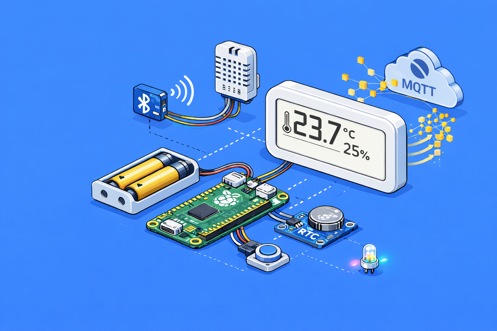

# Mastering IoT: The Things

This project contains source code for THSensor - smart temperature and humidity sensor written in MicroPython.




## Additional Packages

You need following additional packages to install:

```python
# for better handling of filesystem/file operations
>>> mip.install('pathlib')

# for MQTT support
>>> mip.install('umqtt.robust')

# RTC module DS3231 support
>>> mip.install('github:peterhinch/micropython-samples/DS3231/ds3231_gen.py')

# BT Home support
>>> mip.install('github:DavesCodeMusings/BTHome-MicroPython')

# Microdoct - The impossibly small web framework (with utemplate)
>>> mip.install('github:miguelgrinberg/microdot/src/microdot/microdot.py')
>>> mip.install('github:miguelgrinberg/microdot/src/microdot/utemplate.py')
```


## Links

* [THSensor](https://github.com/bletvaska/mastering-iot-the-things) - project homepage at GitHub
* [MicroPython](https://micropython.org/) - project homepage
